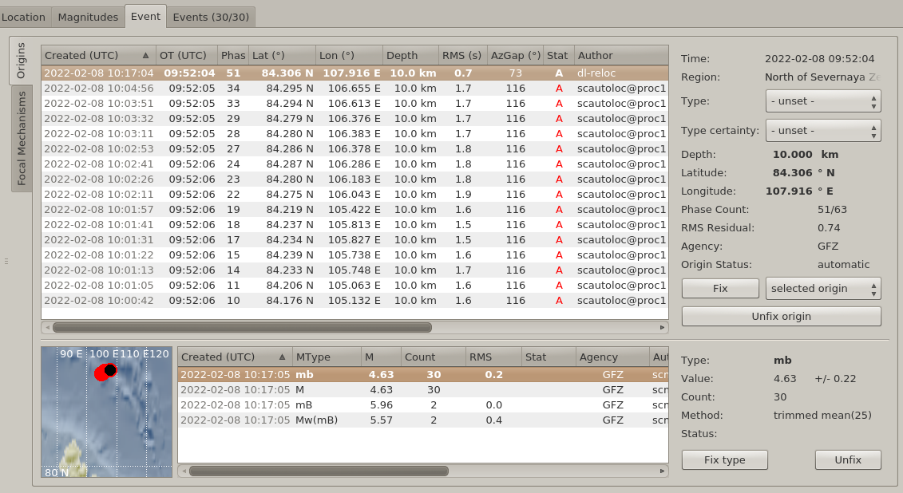
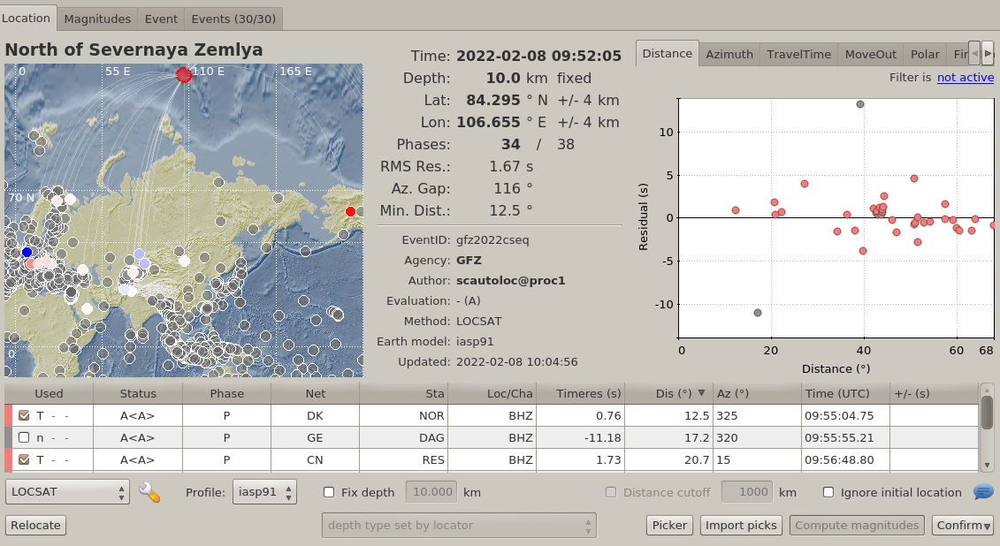
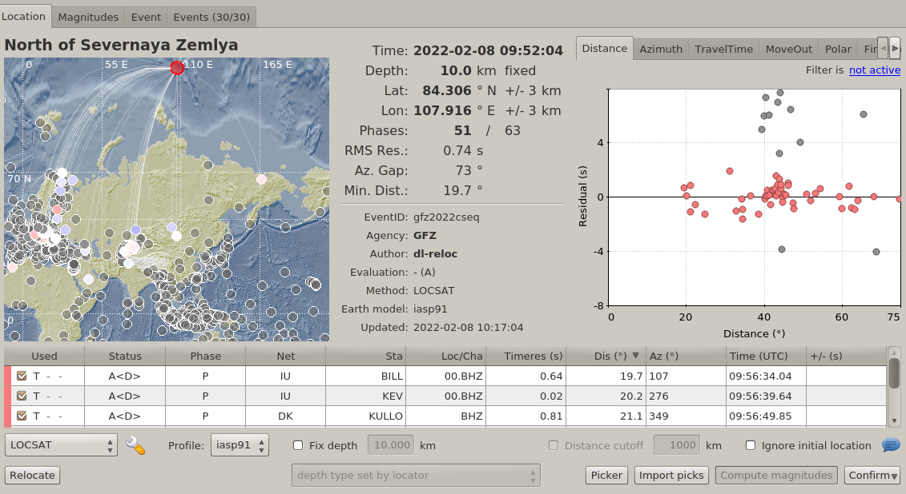

# Relocate an event based on DL picks only

There is a utility `scdlpicker.relocate-event.py` which is more of a proof of concept but can be used to load DL picks from the database and perform a relocation based on *only* these picks.

For a global monitoring as the 24/7 monitoring of GFZ Potsdam, a default picker configuration is used that usually gives decent performance for sufficiently large event. But that default configuration is a compromise and very often there are more and usually better picks produced by the DL repicker.

Below is an example for a magnitude 4.6 event in the Arctic Ocean. The automatic SeisComP location with the default configuration for global monitoring gave a decent location based on 34 automatic picks produced by scautopick and processed by scautoloc. Note that the residual RMS here is 1.7 seconds.

The DL relocator was running in parallel producing improved picks based on existing picks and also looked for possibilities to obtain additional picks on hitherto unpicked streams. Around 25 minutes after origin time `scdlpicker.relocate-event.py` was run manually to collect the DL picks matching this event.

```
scexec scdlpicker.relocate-event.py -H geofon-proc --debug --fixed-depth 10 --event gfz2022cseq
```

Note that based on the remote location near a mid-ocean ridge the depth resolution is expected to be very poor and therefore the depth was fixed at the usual default depth of 10 km.

The script connected to `geofon-proc`, which is the machine running the automatic processing. The event ID is [gfz2022cseq](http://geofon.gfz-potsdam.de/eqinfo/event.php?id=gfz2022cseq)

Below the output of the above call (with irrelevant debug messages removed).

```
11:17:04 [info] Using fixed depth of 10 km
11:17:04 [info] sent Origin/20220208101704.923884.127727
Origin Origin/20220208101704.923884.127727
  Status      automatic / NULL
  Time       2022-02-08 09:52:04.9
  Latitude    +84.306
  Longitude  +107.916
  Depth        10 km fixed
  Arr used  51
  Arr all   63
  Pha count 51
  Sta count 51
  RMS        0.74
11:17:04 [info] Keep 2 messages in the backlog
11:17:04 [info] Disconnecting from database
```

With an RMS of less than 1 second this solution is publishable as is. It is a significant improvement over the previous solution with an RMS more than twice as large and fewer picks.

In the `scolv` GUI the result looks as follows:

List of origins for event [gfz2022cseq](http://geofon.gfz-potsdam.de/eqinfo/event.php?id=gfz2022cseq):




Latest `scautoloc` origin (computed using picks from `scautopick`) for event [gfz2022cseq](http://geofon.gfz-potsdam.de/eqinfo/event.php?id=gfz2022cseq):




Origin relocated using DL picks for event [gfz2022cseq](http://geofon.gfz-potsdam.de/eqinfo/event.php?id=gfz2022cseq):


